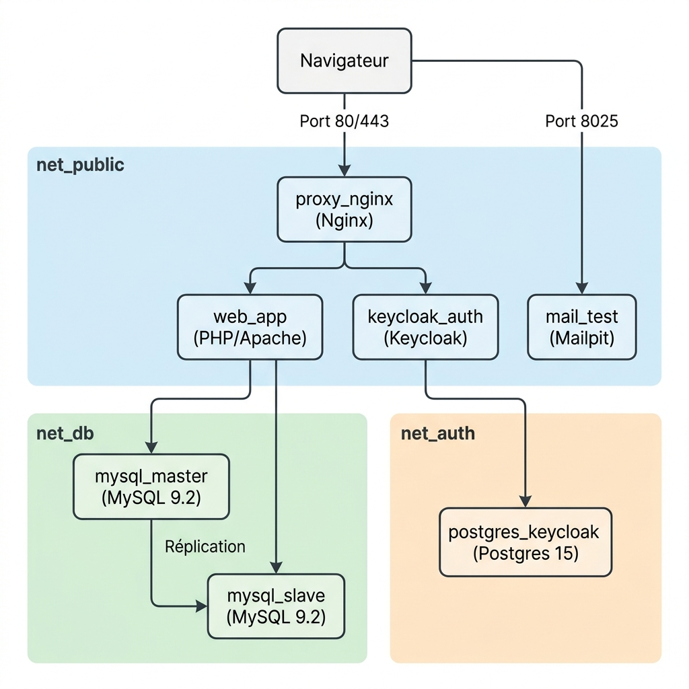

# TP5 - Infrastructure Docker

## Schéma des flux réseaux



### Résumé des réseaux

| Réseau       | Conteneurs connectés                          |
|-------------|-----------------------------------------------|
| `net_public` | proxy_nginx, web_app, keycloak_auth, mail_test |
| `net_db`     | web_app, mysql_master, mysql_slave             |
| `net_auth`   | keycloak_auth, postgres_keycloak               |

## Prérequis

Ajouter le domaine local dans le fichier hosts :
```bash
echo "127.0.0.1 tp5.local" | sudo tee -a /etc/hosts
```

Vérifier :
```bash
ping tp5.local
```

## Commande de déploiement

```bash
docker compose up -d --build
```

Pour arrêter :
```bash
docker compose down
```

Pour tout supprimer (y compris les volumes) :
```bash
docker compose down -v
```

## Configuration de la réplication MySQL (Master → Slave)

Une fois les conteneurs lancés, exécuter les commandes suivantes :

### 1. Créer l'utilisateur de réplication sur le Master

```bash
docker exec -it mysql_master mysql -uroot -prootpass123 -e "
CREATE USER 'repl_user'@'%' IDENTIFIED BY 'replpass123';
GRANT REPLICATION SLAVE ON *.* TO 'repl_user'@'%';
FLUSH PRIVILEGES;
"
```

### 2. Récupérer la position du binlog sur le Master

```bash
docker exec -it mysql_master mysql -uroot -prootpass123 -e "SHOW MASTER STATUS\G"
```

Noter les valeurs de `File` (ex: `mysql-bin.000003`) et `Position` (ex: `1234`).

### 3. Configurer le Slave

Remplacer `FICHIER_BINLOG` et `POSITION` par les valeurs obtenues à l'étape 2 :

```bash
docker exec -it mysql_slave mysql -uroot -prootpass123 -e "
CHANGE MASTER TO
  MASTER_HOST='mysql_master',
  MASTER_USER='repl_user',
  MASTER_PASSWORD='replpass123',
  MASTER_LOG_FILE='FICHIER_BINLOG',
  MASTER_LOG_POS=POSITION;
START SLAVE;
"
```

### 4. Vérifier la réplication

```bash
docker exec -it mysql_slave mysql -uroot -prootpass123 -e "SHOW SLAVE STATUS\G"
```

Vérifier que `Slave_IO_Running: Yes` et `Slave_SQL_Running: Yes`.

### 5. Test de synchronisation

Insérer une donnée sur le master :
```bash
docker exec -it mysql_master mysql -uroot -prootpass123 -e "
USE app_db;
INSERT INTO voitures (marque, modele, annee, couleur) VALUES ('BMW', 'Serie 3', 2024, 'Blanc');
"
```

Vérifier sur le slave :
```bash
docker exec -it mysql_slave mysql -uroot -prootpass123 -e "SELECT * FROM app_db.voitures;"
```

## Configuration de Keycloak

Après le premier démarrage :

1. Accéder à `http://tp5.local/auth` → Admin Console
2. Login : `admin` / `admin`
3. Créer un realm nommé `tp5`
4. Dans le realm `tp5`, créer un client :
   - Client ID : `tp5-app`
   - Client Protocol : `openid-connect`
   - Access Type : `public`
   - Valid Redirect URIs : `http://tp5.local/*`
5. Créer un utilisateur de test dans le realm `tp5`

## Structure du projet

```
tp5-rendu/
├── docker-compose.yml      # Orchestration de tous les services
├── nginx.conf              # Configuration du reverse proxy
├── mysql.env               # Variables MySQL (gitignored)
├── postgres.env            # Variables PostgreSQL (gitignored)
├── .gitignore
├── README.md
├── html/                   # Pages PHP (volume monté dans web_app)
│   ├── index.php           # Accueil + authentification Keycloak
│   ├── master.php          # Affichage voitures - base master
│   ├── slave.php           # Affichage voitures - base slave
│   └── mailpit.php         # Interface Mailpit
├── mysql_master/
│   ├── master.cnf          # Configuration MySQL master
│   └── init.sql            # Script d'initialisation (table voitures)
└── mysql_slave/
    └── slave.cnf           # Configuration MySQL slave
```
