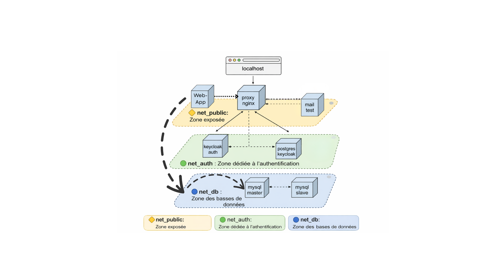

# CLAVEL_POPELIN_MONFORT_TP5_DOCKER

---

# TP5 Virtualisation

---

## Table des matières

* [Partie 1 : Schéma des flux réseaux](#partie1)
* [Partie 2 : Commande de déploiement](#partie2)
* [Partie 3 : Configuration réplication MySQL (master/slave)](#partie3)

---

<a id="partie1"></a>

## Partie 1 : Schéma des flux réseaux



---

<a id="partie2"></a>

## Partie 2 : Commande de déploiement

Lancer les conteneurs avec la commande suivante :

```bash
docker compose up -d --build
```

---

<a id="partie3"></a>

## Partie 3 : Configuration réplication MySQL (master/slave)

Pour se connecter à Keycloak en mode administrateur :
[http://tp5.local/auth/admin/](http://tp5.local/auth/admin/)

* Identifiant : admin
* Mot de passe : admin

Pour se connecter à Keycloak en utilisation classique :
[http://tp5.local](http://tp5.local)

* Identifiant : test
* Mot de passe : password