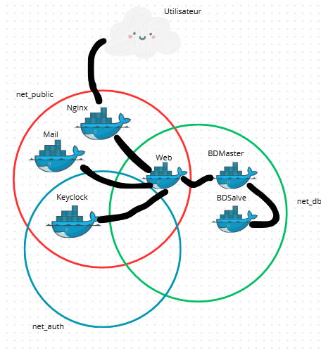

# TP5 - Virtualisation : Architecture Docker Complète

Chloé LARCHER  
Matteo MELANDRI 

---

##  Table des matières

1. [Architecture et flux réseau](#architecture-et-flux-réseau)
2. [Prérequis](#prérequis)
3. [Structure du projet](#structure-du-projet)
4. [Déploiement](#déploiement)
5. [Configuration de la réplication MySQL](#configuration-de-la-réplication-mysql)
6. [Tests de fonctionnement](#tests-de-fonctionnement)

---

##  Architecture et flux réseau

### Schéma de l'infrastructure


---

##  Prérequis

- Docker 24.0+
- Docker Compose 2.20+
- Accès administrateur pour modifier le fichier hosts

---

##  Configuration du domaine local

Ajout dans le fichier hosts :
**Windows :** `C:\Windows\System32\drivers\etc\hosts`  
127.0.0.1 tp5.local


Vérification :
```bash
ping tp5.local 
```

Déploiement  
```bash
docker-compose up -d
```
Vérification  
```bash
bash
docker ps
```