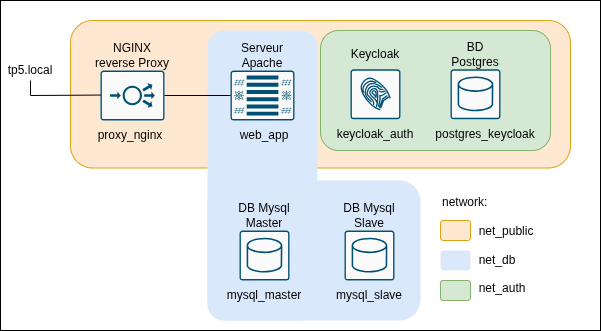

## Virtu-TP5-ArthurT-PaulT-MathisL

### Schema archi docker:

### 1. Réseaux (Isolation) Vous devez créer 3 réseaux custom de type bridge :
   * net_public : Zone exposée.
   * net_db : Zone des bases de données applicatives.
   * net_auth : Zone dédiée à l'authentification.
### 2. Reverse Proxy (Nginx), (cf annexe 1).
   * Nom de conteneur : proxy_nginx
   * Rôle : Point d'entrée unique de la stack. Expose les ports 80 (HTTP) et 443 (HTTPS) sur la
   machine hôte. Il redirige le trafic vers le service web.
   * Réseau : net_public uniquement.
### 3. Serveur Web Applicatif
   * Nom de conteneur : web_app
   * Rôle : Serveur Apache/PHP ou NodeJS (créé via un Dockerfile personnalisé avec les
   extensions nécessaires). Ne doit exposer aucun port directement sur la machine hôte.
   * Réseaux : net_public et net_db.
### 4. Bases de données (Haute Disponibilité)
   * Noms de conteneurs : mysql_master et mysql_slave (images mysql:9.2).
   * Rôle : Le master reçoit les écritures, le slave réplique les données. Les données et les fichiers
   de configuration personnalisés (master.cnf, slave.cnf) doivent être montés via des
   volumes. Les mots de passe doivent provenir d'un fichier .env.
   * Réseau : net_db uniquement.
   * Note : La configuration de la réplication se fera via des commandes docker exec une fois les
   conteneurs lancés.
   1
### 5. Authentification (Keycloak, cf annexe 2)
   * Conteneurs : keycloak_auth (image quay.io/keycloak/keycloak:latest) et sa base
   de données postgres_keycloak (image postgres:15). Attention : pour Keycloak, il faut
   impérativement surcharger la commande de démarrage du conteneur avec start-dev pour qu'il
   puisse fonctionner en environnement local.
   * Rôle : Gestion des identités. Keycloak doit attendre (orchestration, annexe 3) que Postgres
   soit démarré pour se lancer.
   * Réseaux : net_public et net_auth pour Keycloak. net_auth uniquement pour Postgres.
### 6. Serveur de Messagerie
   * Conteneur : mail_test (image axllent/mailpit).
   * Rôle : Intercepteur SMTP pour tester l'envoi de mails depuis le serveur web. Expose le port
   8025 pour consulter l'interface web.
   * Réseau : net_public.